# QAA

## Versions

**Conda environment:** QAA

**Python version:** 3.12

**fastqc version:** 0.12.1

**cutadapt version**: 0.9

For a more detailed version history visit [all_packages.txt](general_info/all_packages.txt)

## Part 1

### Data Exploration:

Done with the following srun

```bash
srun -A bgmp -p bgmp --mem=30G --pty bash
```

My file assignments are:

- `34_4H_both_S24_L008`
  - alias: `34_4H`

- `21_3G_both_S15_L008`
  - alias: `21_3G`

The path to these files are:

```bash
/projects/bgmp/shared/2017_sequencing/demultiplexed/34_4H_both_S24_L008_R1_001.fastq.gz
/projects/bgmp/shared/2017_sequencing/demultiplexed/34_4H_both_S24_L008_R2_001.fastq.gz
/projects/bgmp/shared/2017_sequencing/demultiplexed/21_3G_both_S15_L008_R1_001.fastq.gz
/projects/bgmp/shared/2017_sequencing/demultiplexed/21_3G_both_S15_L008_R2_001.fastq.gz
```

### File size

```bash
ls -lh /projects/bgmp/shared/2017_sequencing/demultiplexed/ | grep 21_3G
-rw-r-----+ 1 coonrod is.racs.pirg.bgmp 480M Aug 23  2017 21_3G_both_S15_L008_R1_001.fastq.gz
-rw-r-----+ 1 coonrod is.racs.pirg.bgmp 535M Aug 23  2017 21_3G_both_S15_L008_R2_001.fastq.gz
ls -lh /projects/bgmp/shared/2017_sequencing/demultiplexed/ | grep 34_4H
-rw-r-----+ 1 coonrod is.racs.pirg.bgmp 469M Aug 23  2017 34_4H_both_S24_L008_R1_001.fastq.gz
-rw-r-----+ 1 coonrod is.racs.pirg.bgmp 525M Aug 23  2017 34_4H_both_S24_L008_R2_001.fastq.gz
```

The file sizes are closer group around their R1/R2 designation, not the index label.
This could indicate that these files have a similar number of reads returned.

### Number of records

Done with: `zcat file_path | awk 'END {print NR/4}'`

|File|record count|
|------|------------|
|34_4H_R1|9040597|
|34_4H_R2|9040597|
|21_3G_R1|9237299|
|21_3G_R2|9237299|

Within an index label (34_4H, 21_3G) the number of records is the same. It appears that record 21_3G yielded slighly more records (2.1% more to be exact). This small difference is likely insignificant. So the difference in R1 vs R2 file size does not lie in the number of records, is it possibly due to record length?

### Record length

Done with `zcat file_path | awk 'NR%4==2{print length($0)}'| uniq -c`
With this I verified the record length was 101 for **every** file I was assigned. This makes sense because no trimming software has been used.

### Command line FASTQC

```bash
#Command used 
/usr/bin/time -v fastqc -o timing/ -t 8 /projects/bgmp/shared/2017_sequencing/demultiplexed/34_4H_both_S24_L008_R1_001.fastq.gz /projects/bgmp/shared/2017_sequencing/demultiplexed/34_4H_both_S24_L008_R2_001.fastq.gz /projects/bgmp/shared/2017_sequencing/demultiplexed/21_3G_both_S15_L008_R1_001.fastq.gz /projects/bgmp/shared/2017_sequencing/demultiplexed/21_3G_both_S15_L008_R2_001.fastq.gz

#with timing
Percent of CPU this job got: 97%
Elapsed (wall clock) time (h:mm:ss or m:ss): 2:33.07
Maximum resident set size (kbytes): 480804
Average resident set size (kbytes): 0
Exit status: 0
```

Was a bit slower than expected but working at a cafe with iffy wifi so not surprising

I unzipped my results from this (located at `output_FASTQC_part1/`) and summarized the relevant data below

For more detailed interpretation of my FASTQC results, see my Rmarkdown

#### 21_3G_R1


|Score|On|Original File|
|------|----|-------------|
|PASS |Per base sequence quality| 21_3G_R1|
|PASS| Per base N content| 21_3G_R1|


##### 21_3G_R1 N-content


*N-content across position*

N-content stays extremely low throughout.  

##### 21_3G_R1 Per-base quality

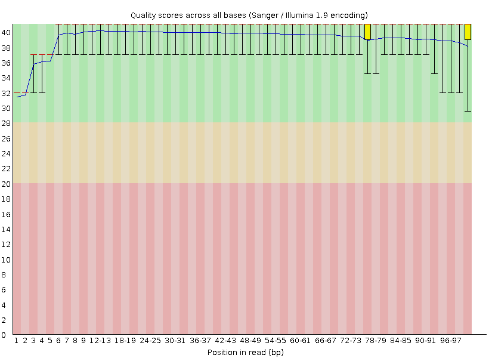

*Quality across position* 

These quality scores are high, while the quality varies near the ends, all scores stay within the green zone.

#### 21_3G_R2

|Score|On|Original File|
|------|----|-------------|
|PASS |   Per base sequence quality| 21_3G_R2|
|PASS|Per base N content| 21_3G_R2|

##### 21_3G_R2 N-content

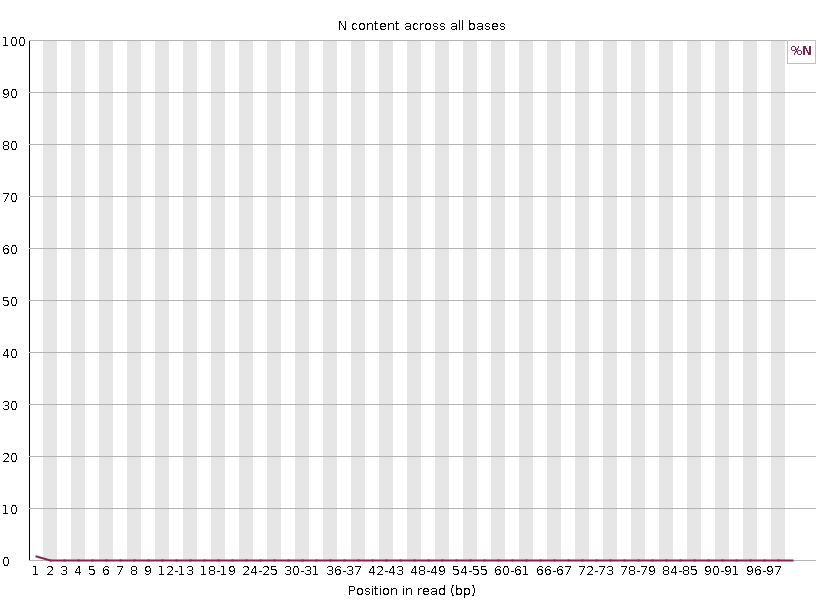

N-content stays extremely low throughout.  

##### 21_3G_R2 Per-base quality

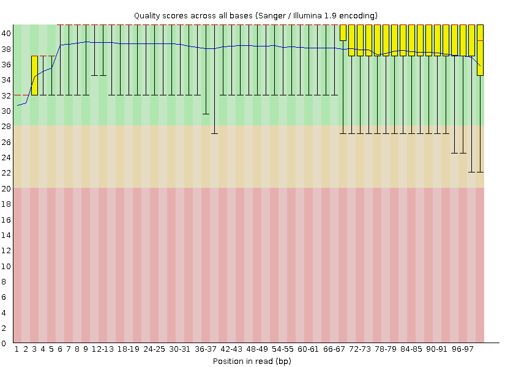

These quality scores are high, while the outliers on the 3' end veer into the yellow zone, all mean and median scores stay within the green zone.


#### 34_4H_R1

|Score|On|Original File|
|------|----|-------------|
|PASS| Per base sequence quality| 34_4H_R1|
|PASS| Per base N content | 34_4H_R1.fastq.gz|

##### 34_4H_R1 N-content


*N-content across position*
N-content stays extremely low throughout. 

##### 34_4H_R1 Per-base quality

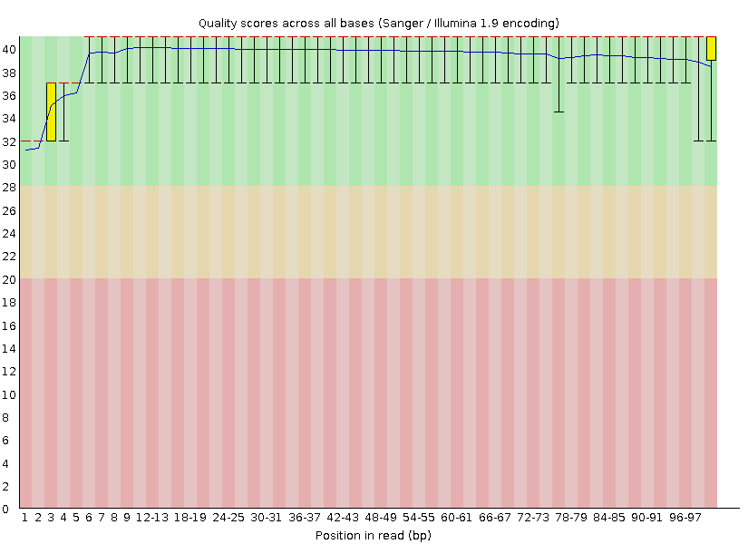

These quality scores are high, while the quality varies near the ends, all scores stay within the green zone.

#### 34_4H_R2

|Score|On|Original File|
|------|----|-------------|
|PASS| Per base sequence quality| 34_4H_R2|
|PASS| Per base N content | 34_4H_R2|

##### 34_4H_R2 N-content


N-content stays extremely low throughout.  

##### 34_4H_R2 Per-base quality

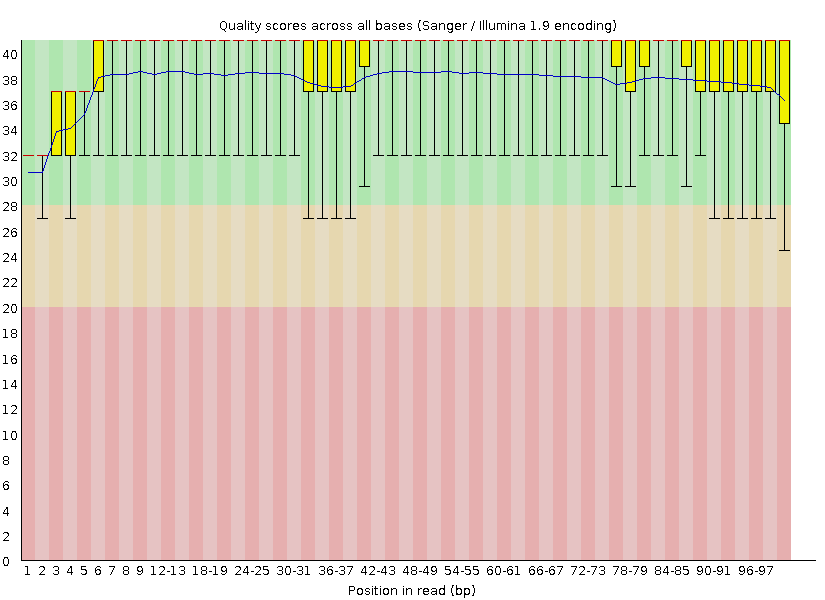 

These quality scores are high, while the outliers on the 5' and 3' end veer into the yellow zone, all mean and median scores stay within the green zone.


### My qscore script

**Note:** Used Demultiplexing code located at `../Demultiplex/Assignment-the-first/part1.py` [link](../Demultiplex/Assignment-the-first/part1.py) to create my mean quality-score-by-base files and then I used my Demultiplexing code located at `/home/jujo/bgmp/bioinfo/PS/Demultiplex/Assignment-the-first/part1_graphs.py` [link](../Demultiplex/Assignment-the-first/part1_graphs.py) to graph said files. 

#### Alterations to the original script

I had to review my Demultiplex code to explicity add argparse for record length.
This is because R2 in demultiplex was an index file (with record length 8)
while our R2 is the equivalent to R4 and has a record length of 101. Once I
fixed this I was ready to run my old code.

I did this in two separate sbatch runs located in the `/home/jujo/bgmp/bioinfo/PS/QAA/output_my_qs_plotting_part1/` folder ([qs_plotting_21](output_my_qs_plotting_part1/qs_plotting_21.sh) and [qs_plotting_34](output_my_qs_plotting_part1/qs_plotting_34.sh)) to speed this up.

#### 21_3G_R1

##### 21_3G_R1 Means

```bash
/usr/bin/time -v python /home/jujo/bgmp/bioinfo/PS/Demultiplex/Assignment-the-first/part1.py \
-f /projects/bgmp/shared/2017_sequencing/demultiplexed/21_3G_R1.fastq.gz \
-R2 False> 21_3G_R1_means.txt
Percent of CPU this job got: 99%
Elapsed (wall clock) time (h:mm:ss or m:ss): 5:04.88
Maximum resident set size (kbytes): 28760
Average resident set size (kbytes): 0
Exit status: 0
```

##### 21_3G_R1 Graphs

```bash
/usr/bin/time -v python /home/jujo/bgmp/bioinfo/PS/Demultiplex/Assignment-the-first/part1_graphs.py \
-f 21_3G_R1_means.txt

Elapsed (wall clock) time (h:mm:ss or m:ss): 0:00.44
Maximum resident set size (kbytes): 62264
Average resident set size (kbytes): 0
Exit status: 0
```

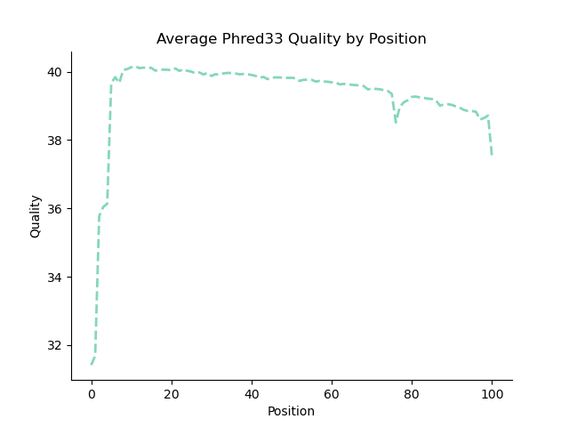

### 21_3G_R2

#### 21_3G_R2 Means

```bash
#command 
/usr/bin/time -v python /home/jujo/bgmp/bioinfo/PS/Demultiplex/Assignment-the-first/part1.py \
-f /projects/bgmp/shared/2017_sequencing/demultiplexed/21_3G_both_S15_L008_R2_001.fastq.gz \
-R2 True > 21_3G_R2_means.txt

#with the output
Percent of CPU this job got: 99%
Elapsed (wall clock) time (h:mm:ss or m:ss): 5:08.32
Maximum resident set size (kbytes): 28664
Average resident set size (kbytes): 0
Exit status: 0
```

#### 21_3G_R2 Graphs

```bash
/usr/bin/time -v python /home/jujo/bgmp/bioinfo/PS/Demultiplex/Assignment-the-first/part1_graphs.py \
-f 21_3G_R2_means.txt

Elapsed (wall clock) time (h:mm:ss or m:ss): 0:00.45
Maximum resident set size (kbytes): 60428
Average resident set size (kbytes): 0
Exit status: 0
```

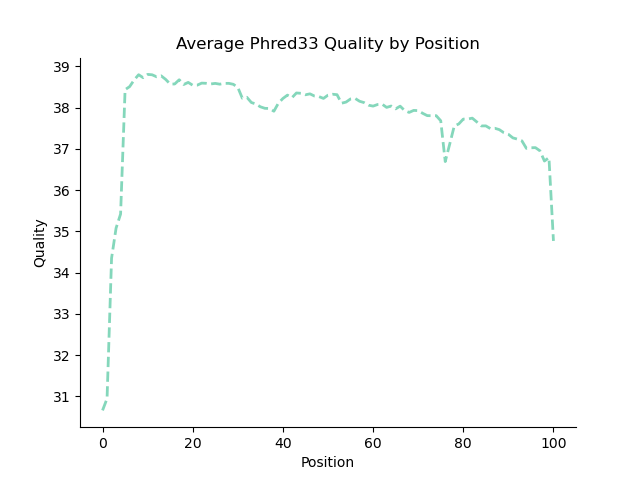

#### 34_4H_R1

##### 34_4H_R1 Means

```bash
#command
/usr/bin/time -v python /home/jujo/bgmp/bioinfo/PS/Demultiplex/Assignment-the-first/part1.py \
-f /projects/bgmp/shared/2017_sequencing/demultiplexed/34_4H_both_S24_L008_R1_001.fastq.gz \
-R2 False > 34_4H_R1_means.txt
#with the output
Percent of CPU this job got: 99%
Elapsed (wall clock) time (h:mm:ss or m:ss): 5:07.19
Maximum resident set size (kbytes): 28628
Average resident set size (kbytes): 0
Major (requiring I/O) page faults: 0
```

##### 34_4H_R1 Graphs

```bash
/usr/bin/time -v python \
/home/jujo/bgmp/bioinfo/PS/Demultiplex/Assignment-the-first/part1_graphs.py \
-f 34_4H_R1_means.txt

Elapsed (wall clock) time (h:mm:ss or m:ss): 0:01.90
Maximum resident set size (kbytes): 61556
Average resident set size (kbytes): 0
Exit status: 0
```

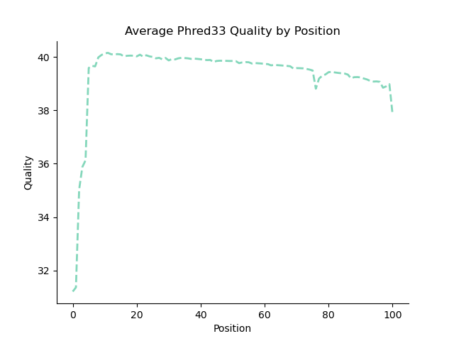

#### 34_4H_R2

##### 34_4H_R2 Means

```bash
/usr/bin/time -v python /home/jujo/bgmp/bioinfo/PS/Demultiplex/Assignment-the-first/part1.py \
-f /projects/bgmp/shared/2017_sequencing/demultiplexed/34_4H_both_S24_L008_R2_001.fastq.gz \
-R2 True > 34_4H_R2_means.txt
Percent of CPU this job got: 99%
Elapsed (wall clock) time (h:mm:ss or m:ss): 5:17.67
Maximum resident set size (kbytes): 28548
Average resident set size (kbytes): 0
Exit status: 0
```

##### Graphs

```bash
/usr/bin/time -v python /home/jujo/bgmp/bioinfo/PS/Demultiplex/Assignment-the-first/part1_graphs.py \
-f 34_4H_R2_means.txt

Elapsed (wall clock) time (h:mm:ss or m:ss): 0:00.79
Maximum resident set size (kbytes): 60776
Average resident set size (kbytes): 0
Exit status: 0
```

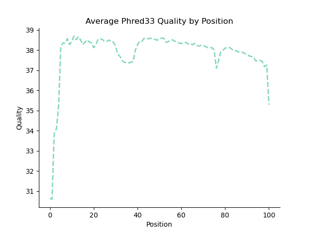


### FastQC quality score vs. mine

The FASTQC data plots impart much more information than my own. My plots solely map the mean quality distribution by position. Thus, I cannot see when my quality scores are lowered due to outliers or from low quality as a whole. In contrast, FASTQC calculates the mean, median, and IQR. And while my mean line and FASTQC's mean line look identical, the FASTQC's multi-metric methodology handles outliers much better. 

FASTQC also incorporates great visual cues into their plots: a hard ylim of 40 and quality color coding in the figure's background. These additions make interpreting quality scores much simpler at a glance. In my code, I did not set a hard ylim. So, if a whole run is relatively worse than normal, my y-axis maximum will be lower than 40 this coupled with the lack of background color coding can mask the low-quality nature of the run at first glance.

#### Runtime

|File|Script|Runtime (seconds)|
|------|----|-------------|
|21_3G_R1| mine| 304.88|
|21_3G_R1| FASTQC | 38.27*|
|21_3G_R2| mine| 308.32|
|21_3G_R2| FASTQC | 38.27*|
|34_4H_R1| mine| 307.19|
|34_4H_R1| FASTQC | 38.27*|
|34_4H_R2| mine| 317.67|
|34_4H_R2| FASTQC | 38.27*|
|average|mine|309.52|
|average|FASTQC|38.27|

*Ran all files at once and divided total run time by 4.


On average, FASTQC is `(309.52/38.27)=8.1` times **faster** than my code!

This large disparity in speed makes sense. I wrote my De-multiplexing code in one week in Python, while FASTQC was built by a team in 2010 in Java (a generally faster language) and continually improved over the past decade. Even in the one week I spent on De-multiplexing I was able to greatly speed up my code. This is a case of disparity in time and resources.

#### Memory/CPU usuage 

|File|Script| % CPU used|
|------|----|-------------|
|21_3G_R1| mine| 99|
|21_3G_R1| FASTQC |97|
|21_3G_R2| mine| 99|
|21_3G_R2| FASTQC |97|
|34_4H_R1| mine| 99|
|34_4H_R1| FASTQC | 99|
|34_4H_R2| mine| 99|
|34_4H_R2| FASTQC |97|

CPU usage was consistent across runs, with FASTQC using slightly less CPU than my own code. This difference is slight enough to be insignificant. 

### Comment on overall data quality

#### 21_3G Overall quality

|Recommendation| Metric| File|
|--------------|-------|-----|
|PASS|	Per base sequence quality	|R1, R2|
|PASS	|Per base N content| R1, R2|
|PASS	|Sequence Length Distribution| R1, R2|
|WARN	|Sequence Duplication Levels| R1, R2|
|FAIL|Per tile sequence quality	|R1, R2|
|FAIL	|Per base sequence content	|R1|
|WARN	|Per base sequence content|	R2|
|PASS	|Per sequence GC content	|R1, R2|
|WARN	|Overrepresented sequences | R1, R2|
|PASS	|Adapter Content	|R1, R2|

*These metrics are discussed in detail in my Rmarkdown report*

With the metrics discussed in my Rmarkdown report in mind, it's is safe to say that both `21_3G` files are high enough quality to proceed with further analysis. Most metrics passed, and those that produced a warning or failure make sense (sequence
duplication) or can be fixed downstream (per-base sequence content).

#### 34_4H Overall quality

|Recommendation| Metric| File|
|--------------|-------|-----|
|PASS|	Per base sequence quality|	R1, R2|
|PASS|	Per base N content| R1, R2|
|PASS|	Sequence Length Distribution|	R1, R2|
|WARN|	Sequence Duplication Levels|	R1, R2|
|FAIL|	Per tile sequence quality| R1, R2|
|FAIL|	Per base sequence content|	R1|
|WARN|	Per base sequence content|	R2|
|PASS|	Per sequence GC content|	R1, R2|
|WARN|	Overrepresented sequences|	R1, R2|
|PASS|	Adapter Content|	R1, R2|

*These metrics are discussed in detail in my Rmarkdown report*

With the metrics discussed in my Rmarkdown report in mind, it's is safe to say that both `34_4H` files are high enough quality to proceed with further downstream analysis. Though my `21_3G` data is higher quality than my `34_4H` most metrics passed, and those that produced a warning or failure make sense (sequence duplication) or can be fixed downstream (per-base sequence content).

## Part 2

After verifying my cutadapt and trimmomatric versions matched our specifications I proceeded

With the following srun

```bash
srun -A bgmp -p bgmp --mem=30G --pty bash
```

### Cutadapt

#### Determine adapters

Mechanistically in one run, adapters won't be present in every sequence. They
may not even be the top hit. But because Illumina uses universal adapters, we
can compare across disparate runs (`file_path_34_4H_RN` and `file_path_21_3G_RN`).
Comparing across files, the universal adapter should be the unifying sequence. I
checked this logic with the following bash command:

##### R1 adapter

```bash
#cut -c 69- grabs our adapter size (known length from Bi622) from the end of the sequence
zcat file_path_34_4H_RN file_path_21_3G_RN | cut -c 69- | awk 'NR%4==2{print $0}' \
| sort | uniq -c | sort -nr | head -n 1

#with the output
14311 AGATCGGAAGAGCACACGTCTGAACTCCAGTCA
```

AGATCGGAAGAGCACACGTCTGAACTCCAGTCA,  was indeed our R1 adapter

##### R2 adapter

```bash
  14364 AGATCGGAAGAGCGTCGTGTAGGGAAAGAGTGT
```

AGATCGGAAGAGCGTCGTGTAGGGAAAGAGTGT,  was indeed our R2 adapter :exploding_head:

With both adapters determined, I could move to using `cutadapt`

#### Cutadapt Run 

##### 21_3G percent trimmed

For my `cutadapt` run I used the following command

```bash
/usr/bin/time -v cutadapt -a AGATCGGAAGAGCACACGTCTGAACTCCAGTCA -A AGAT
CGGAAGAGCGTCGTGTAGGGAAAGAGTGT -o output_cutadapt_part2/21_3G_both_S15_L008_R1_001_trimmed.fastq
 -p output_cutadapt_part2/21_3G_both_S15_L008_R2_001_trimmed.fastq /projects/bgmp/shared/2017_s
equencing/demultiplexed/21_3G_both_S15_L008_R1_001.fastq.gz /projects/bgmp/shared/2017_sequenci
ng/demultiplexed/21_3G_both_S15_L008_R2_001.fastq.gz

#with the output
Percent of CPU this job got: 98%
Elapsed (wall clock) time (h:mm:ss or m:ss): 0:41.58
Maximum resident set size (kbytes): 37492
Average resident set size (kbytes): 0
Exit status: 0
```

This run produced the following trimmed proportions

- 21_3G_R1 proportion trimmed 6.6%
- 21_3G_R2 proportion trimmed 7.4%

##### 34_4H percent trimmed

```bash
#command
/usr/bin/time -v cutadapt -a AGATCGGAAGAGCACACGTCTGAACTCCAGTCA -A AGAT
CGGAAGAGCGTCGTGTAGGGAAAGAGTGT -o output_cutadapt_part2/34_4H_both_S24_L008_R1_001_trimmed.fastq
 -p output_cutadapt_part2/34_4H_both_S24_L008_R2_001_trimmed.fastq /projects/bgmp/shared/2017_s
equencing/demultiplexed/34_4H_both_S24_L008_R1_001.fastq.gz /projects/bgmp/shared/2017_sequenci
ng/demultiplexed/34_4H_both_S24_L008_R2_001.fastq.gz

#with the output
Percent of CPU this job got: 98%
Elapsed (wall clock) time (h:mm:ss or m:ss): 0:43.88
Maximum resident set size (kbytes): 37488
Average resident set size (kbytes): 0
Exit status: 0
 ```

`cutadapt` produced the following trimmed proportions

- 34_4H_R1 proportion trimmed 9.1%
- 34_4H_R2 proportion trimmed 9.8%


#### Cutadapt interpretation

- Our `34_4H `files were trimmed **more** than our `21_3G` files
- Our R2 files were trimmed more than our R1 files. This makes sense because R2 runs last on the sequencer and thus are typically lower quality than R1. This is reflected in our cutadapt results where the percent % increased of trimmed reads is significant.

With my adapters removed I proceeded to using `Trimmomatic`

### Trimmomatic

**Note:** ran on the same srun as cutadapt

#### 21_3G Trimmomatic

I used the following trimmomatic command 

```bash
/usr/bin/time -v trimmomatic PE \
/home/jujo/bgmp/bioinfo/PS/QAA/output_cutadapt_part2/21_3G_both_S15_L008_R1_001_trimmed.fastq \
/home/jujo/bgmp/bioinfo/PS/QAA/output_cutadapt_part2/21_3G_both_S15_L008_R2_001_trimmed.fastq \
21_3G_R1.paired.fastq.gz 21_3G_R1.unpaired.fastq.gz 21_3G_R2.paired.fastq.gz \
21_3G_R2.unpaired.fastq.gz LEADING:3 TRAILING:3 SLIDINGWINDOW:5:15 MINLEN:35

#with the output
Percent of CPU this job got: 98%
Elapsed (wall clock) time (h:mm:ss or m:ss): 7:06.27
Average resident set size (kbytes): 0
Exit status: 0
```

#### 34_4H Trimmomatic

I used the following trimmomatic command

```bash
/usr/bin/time -v trimmomatic PE /home/jujo/bgmp/bioinfo/PS/QAA/output_cutadapt_part2/34_4H_both_S24_L008_R1_001_trimmed.fastq /home/jujo/bgmp/bioinfo/PS/QAA/output_cutadapt_part2/34_4H_both_S24_L008_R2_001_trimmed.fastq 34_4H_R1.paired.fastq.gz 34_4H_R1.unpaired.fastq.gz 34_4H_R2.paired.fastq.gz 34_4H_R2.unpaired.fastq.gz LEADING:3 TRAILING:3 SLIDINGWINDOW:5:15 MINLEN:35

#with the output
Percent of CPU this job got: 98%
Elapsed (wall clock) time (h:mm:ss or m:ss): 6:53.89
Maximum resident set size (kbytes): 191348
Average resident set size (kbytes): 0
Exit status: 0
```

With my gzipped trimmomatic output I could now proceed to graphing the final length distriutions of my reads. To invesitgate if my response to the above question is valid.

**Note:** For this section, the code and figures below are all stored in `/home/jujo/bgmp/bioinfo/PS/QAA/output_trimmomatic_plotting_part2/`

To measure the proportion of trimmed reads within our trimmomatic results I did the following command on my paired files to give me the lengths of all sequences within my files

```bash
zcat paired_file_path | awk 'NR%4==2{print length($0)}' >file_path_length_distributions.txt
```

I then created the python script [trimm_graph.py](output_trimmomatic_plotting_part2/trimm_graph.py) to calculate the trimmed
proportions (adapter trimming included) and the length distribution graph.

Trimmed proportions were calculated with:

```bash
#get all lengths as integers
r1_list=fh.read().strip().split("\n")
r1_list=[int(x) for x in r1_list]
#we know our untrimmed length is 101 from our EDA
r1_prop_trimmed=((len(r1_list)-r1_list.count(101))/len(r1_list))*100
```

With this code I recieved the following trimmed proportions

|File| Percent trimmed|
|-----|---------------|
|21_3G_R1| 10.8 |
|21_3G_R2| 17.3|
|34_4H_R2| 13.1|
|34_4H_R2| 18.6|


My graph was calculated with:

- A ylog scale for readability

- The two histograms overlaid with `plt.hist([R1,R2])`

This graphing code produced the following graphs.

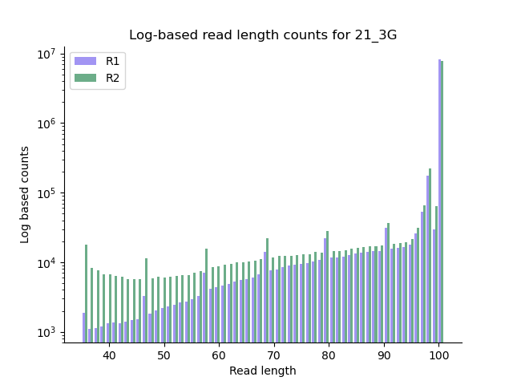

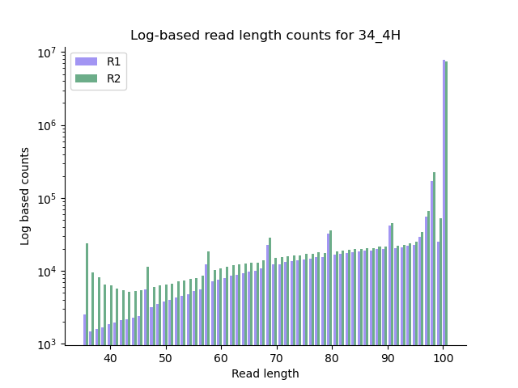

#### R1s and R2s adapter-trimmed at different rates?

R2 files should be adapter trimmed at higher rates than R1 files because R2 files are completed the end of the run. As the run continues reagents and the signal degrades contributing. Signal degradation causes adapter bases to be called in the well over insert bases, causing adapters to be overrepresented. This contributes to the overall lowering of run quality, which we can see from our FASTQ output above.

## Part 3

### Packages installed

- star: `2.7.11b`
  - command used: `conda install STAR`
- numpy: `1.26.4`
  - command used: `conda install numpy` --> already installed
- matplotlib: `3.9.2`
  - command used: `conda install matplotlib` --> already installed
- htseq: `2.0.5 `
  - command used: `conda install htseq`

Can check current state of all packages installed on the QAA conda environment at
[all_packages.txt](general_info/all_packages.txt)

### Data downloaded

**Note:** Performed on the following interactive node: `srun -A bgmp -p bgmp --mem=30G --pty bash`

#### Needle in a haystack

Initally downloaded entire mouse genome with `wget https://ftp.ensembl.org/pub/release-112/fasta/mus_musculus/dna/`
which only gave me an html of the ensembl website :skull:


After examining the wget documentation, I realized I neded to:
- include the `-m`flag
- change my url from `https://ftp` to be `ftps://ftp`

Final sucessful command:

```bash
#command for genome
wget -m ftps://ftp.ensembl.org/pub/release-112/fasta/dna/mus_musculus/

#with the output
FINISHED --2024-09-07 15:00:56--
Total wall clock time: 7m 18s
Downloaded: 78 files, 6.1G in 6m 31s (15.9 MB/s)

#command for gtf
wget -m ftps://ftp.ensembl.org/pub/release-112/gtf/mus_musculus/Mus_musculus.GRCm39.112.gtf.gz
```

This genome `wget` downloaded 78 files. Initally I had no qualms with because I misunderstood STAR database creation to be like BLAST (`makeblastdb folder_name`) 

But after speaking with Jules I realized out database is formed with `STAR --runMode genomeGenerate file1 file2 ... file75` which is **completely** impractical.

I spent almost an hour looking for a consensus genome file on ensembl, and I could not find it.

I decided to look through PS8 (where we last used STAR) and I checked my input file there and found it contained the phrase "primary_assembly"

When I searched for this in my current directory I realized that this primary_assembly was already there
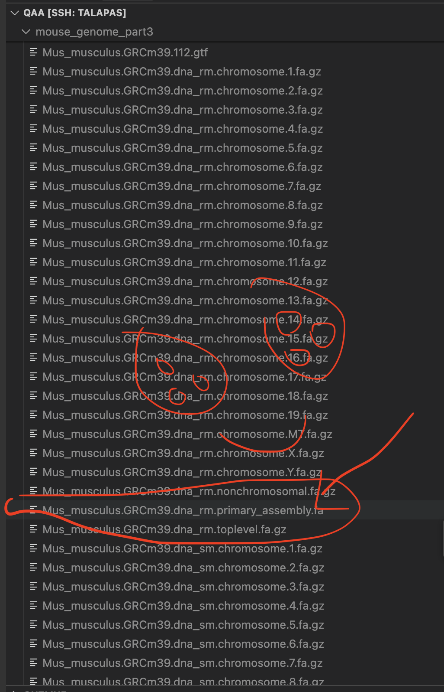

I had downloaded the correct file in the first step :see_no_evil:...So, I could now proceed to running STAR :star:


### Running STAR :star:

#### Confusion about parameters

Initally, I was running genome generate with zipped files and recieving cryptic error messages. After reading the documentation, I proceeded to unzip my relevant files and was able to get STAR to run...

Until my run was `oom killed` because I only specified 16 gb in my sbatch script.

Once I increased my memory to 100 GB, STAR ran sucessfully producing the following output:

#### Genome generate :angel:

Computation done in the [star_genome.sh](mouse_genome_part3/star_genome.sh) sbatch script

```bash
STAR --runThreadN 8 --runMode genomeGenerate --genomeDir \
/home/jujo/bgmp/bioinfo/PS/QAA/mouse_genome_part3/star_genome/ \
--genomeFastaFiles Mus_musculus.GRCm39.dna_rm.primary_assembly.fa \
--sjdbGTFfile Mus_musculus.GRCm39.112.gtf

Percent of CPU this job got: 409%
Elapsed (wall clock) time (h:mm:ss or m:ss): 12:13.57
Maximum resident set size (kbytes): 28288696
Average resident set size (kbytes): 0
Exit status: 0
```

#### Align reads

**Note:** Computation done in [STAR_aln.sh](STAR_mouse_aln_part3/STAR_aln.sh) sbatch script

I then aligned my **paired** `trimmomatic` data against this newly created genomic database

##### 21_3G

```bash
#command
STAR --runThreadN 8 --runMode alignReads --outFilterMultimapNmax 3 --outSAMunmapped Within KeepPairs --alignIntronMax 1000000 --alignMatesGapMax 1000000 --readFilesCommand zcat --readFilesIn /home/jujo/bgmp/bioinfo/PS/QAA/output_trimmomatic_part2/21_3G_R1.paired.fastq.gz /home/jujo/bgmp/bioinfo/PS/QAA/output_trimmomatic_part2/21_3G_R2.paired.fastq.gz --genomeDir /home/jujo/bgmp/bioinfo/PS/QAA/mouse_genome_part3/star_genome/ --outFileNamePrefix mouse_aln/

#with the output
Percent of CPU this job got: 720%
Elapsed (wall clock) time (h:mm:ss or m:ss): 2:47.40
Average resident set size (kbytes): 0
Exit status: 0
```

##### 34_4H

```bash
#command
STAR --runThreadN 8 --runMode alignReads \
--outFilterMultimapNmax 3 --outSAMunmapped Within KeepPairs \
--alignIntronMax 1000000 --alignMatesGapMax 1000000 \
--readFilesCommand zcat --readFilesIn \
/home/jujo/bgmp/bioinfo/PS/QAA/output_trimmomatic_part2/34_4H_R2.paired.fastq.gz \
/home/jujo/bgmp/bioinfo/PS/QAA/output_trimmomatic_part2/34_4H_R2.paired.fastq.gz \
--genomeDir /home/jujo/bgmp/bioinfo/PS/QAA/mouse_genome_part3/star_genome/ \
--outFileNamePrefix 34_mouse_aln/

#with the output
Percent of CPU this job got: 661%
Elapsed (wall clock) time (h:mm:ss or m:ss): 1:43.10
Average resident set size (kbytes): 0
Exit status: 0
```

With this output (`/home/jujo/bgmp/bioinfo/PS/QAA/STAR_mouse_aln_part3/34_4H_mouse_aln/`) I was ready to reuse my PS8 script (located at `/home/jujo/bgmp/bioinfo/PS/ps8-jemdhb/parse_bits.py`)to count paired and unpaired reads. My original script was sound, I just added some argparse to it.

Script run with the same srun as before

### My PS8 script

#### 21_G output

```bash
#command
python ../ps8-jemdhb/parse_bits.py -f STAR_mouse_aln_part3/mouse_aln/Aligned.out.sam

#with the output
Percent of CPU this job got: 98%
Elapsed (wall clock) time (h:mm:ss or m:ss): 0:17.26
Average resident set size (kbytes): 0
Exit status: 0
```

From this call, my `21_G` file was determined to have

- Mapped reads: 15,125,868
- Unmapped reads: 2,580,756

#### 34_4H output

```bash
#command
python ../ps8-jemdhb/parse_bits.py -f STAR_mouse_aln_part3/34_mouse_aln/Aligned.out.sam

#with the output
Percent of CPU this job got: 98%
Elapsed (wall clock) time (h:mm:ss or m:ss): 0:15.07
Average resident set size (kbytes): 0
Exit status: 0
```

From this call, my `34_h` file was determined to have

- Mapped reads: 8,9632
- Unmapped reads in 17,216,650

That is a a lot of unmapped reads...surely that doesn't mean anything...right?

### Running htseq

**Note:** Did not specify an outputfile so my htseq output and slurm logs were combined :skull:

- I parsed out the htseq information with the script [fix_names.py](htseq_count_part3/fix_names.py)

I ran htseq with the following specifications

```bash
#34_4H forward strand
#command
htseq-count --stranded=yes ../STAR_mouse_aln_part3/34_mouse_aln/Aligned.out.sam \
../mouse_genome_part3/Mus_musculus.GRCm39.112.gtf
#with the output
Percent of CPU this job got: 99%
Elapsed (wall clock) time (h:mm:ss or m:ss): 7:05.66
Average resident set size (kbytes): 0
Major (requiring I/O) page faults: 0
Exit status: 0

#34_4H reverse strand
#command
htseq-count --stranded=reverse ../STAR_mouse_aln_part3/34_mouse_aln/Aligned.out.sam \
../mouse_genome_part3/Mus_musculus.GRCm39.112.gtf
#with the  output
Percent of CPU this job got: 99%
Elapsed (wall clock) time (h:mm:ss or m:ss): 7:07.88
Average resident set size (kbytes): 0
Exit status: 0

#21_3G forward strand
#command
htseq-count --stranded=reverse ../STAR_mouse_aln_part3/mouse_aln/Aligned.out.sam \
../mouse_genome_part3/Mus_musculus.GRCm39.112.gtf
#with the output
Percent of CPU this job got: 98%
Elapsed (wall clock) time (h:mm:ss or m:ss): 12:05.88
Average resident set size (kbytes): 0
Major (requiring I/O) page faults: 0
Exit status: 0

#21_3G reverse strand
#command
htseq-count --stranded=yes ../STAR_mouse_aln_part3/mouse_aln/Aligned.out.sam \
../mouse_genome_part3/Mus_musculus.GRCm39.112.gtf
#with the output
Percent of CPU this job got: 99%
Elapsed (wall clock) time (h:mm:ss or m:ss): 11:13.86
Average resident set size (kbytes): 0
Major (requiring I/O) page faults: 0
Exit status: 0
```

My `34_4H` runs were much quicker than my `21_3G` runs...surely this doesnt mean anything...right?

### Something is amiss

When I began to parse my final `htseq` data, I noticed some issues with my `34_4H` results:

#### No differentiation between strandedness

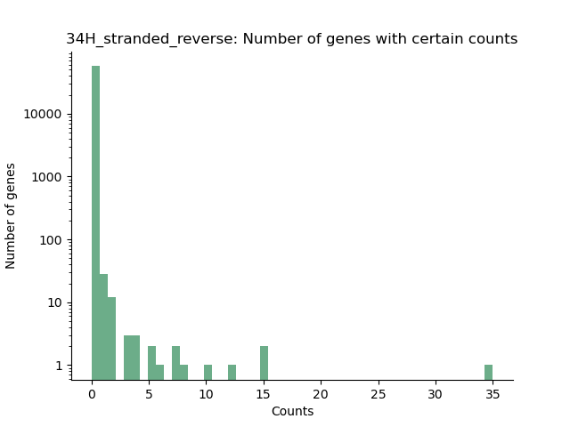

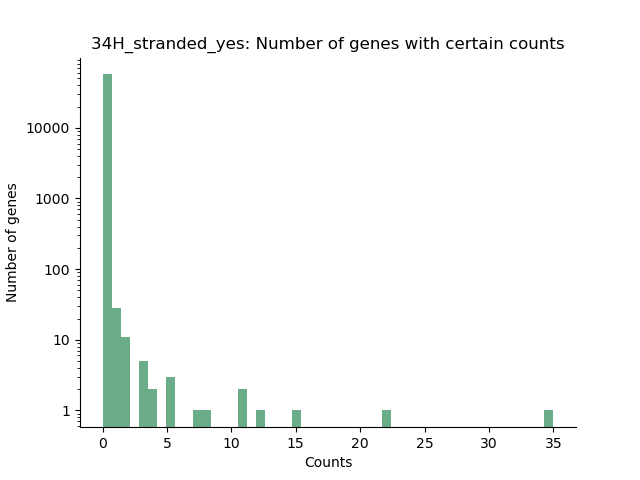

In comparison with my `21_3G` output (discussed in the `Determining Strandedness` section), these were histplots were shockingly similar. My inital concern was that I created the same graph twice and misnamed it, but there is some small differentiation around count=5

I then verified that there is only one correct answer (that both `21_3G` and `34_4H` should both be stranded or unstranded)

Before tearing through all of my bash commands to look for an issue, i wanted to graph one last metric

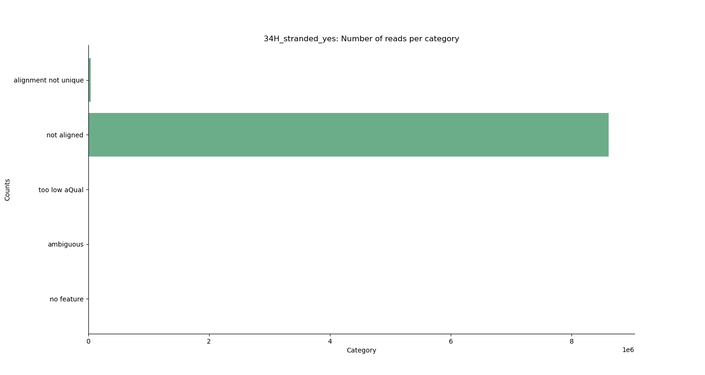


Once I saw that essentially none of my reads mapped here (and my quality values from part 1 were not alarming) I knew some sort of typo had occurred upstream 

After many moons :moon: pouring through this very document I discovered the culprit :star:

```bash
#command
STAR --runThreadN 8 --runMode alignReads \
--outFilterMultimapNmax 3 --outSAMunmapped Within KeepPairs \
--alignIntronMax 1000000 --alignMatesGapMax 1000000 \
--readFilesCommand zcat --readFilesIn \
/home/jujo/bgmp/bioinfo/PS/QAA/output_trimmomatic_part2/34_4H_R2.paired.fastq.gz \
/home/jujo/bgmp/bioinfo/PS/QAA/output_trimmomatic_part2/34_4H_R2.paired.fastq.gz \
--genomeDir /home/jujo/bgmp/bioinfo/PS/QAA/mouse_genome_part3/star_genome/ \
--outFileNamePrefix 34_mouse_aln/
```

Not completely obvious to you, dear reader :book:? I read in the R2 file twice. Thankfully only half of my data was useless and had to be reran.

### Rerunning STAR aln

```bash
#command
STAR --runThreadN 8 --runMode alignReads --outFilterMultimapNmax 3 \
--outSAMunmapped Within KeepPairs --alignIntronMax 1000000 --alignMatesGapMax \ 1000000 --readFilesCommand zcat --readFilesIn \
/home/jujo/bgmp/bioinfo/PS/QAA/output_trimmomatic_part2/34_4H_R1.paired.fastq.gz \
/home/jujo/bgmp/bioinfo/PS/QAA/output_trimmomatic_part2/34_4H_R2.paired.fastq.gz \
--genomeDir /home/jujo/bgmp/bioinfo/PS/QAA/mouse_genome_part3/star_genome/ \
--outFileNamePrefix 34_4H_mouse_aln/
#with the output
Percent of CPU this job got: 640%
Elapsed (wall clock) time (h:mm:ss or m:ss): 1:40.49
Average resident set size (kbytes): 0
Exit status: 0
```

I knew this run was significantly different because my output file was 1.2 GB larger!

### Rerunning ps8 script

```bash
#command
python ../ps8-jemdhb/parse_bits.py -f STAR_mouse_aln_part3/34_4H_mouse_aln/Aligned.out.sam
#with the output
Percent of CPU this job got: 93%
Elapsed (wall clock) time (h:mm:ss or m:ss): 0:17.86
Average resident set size (kbytes): 0
Exit status: 0
```

With the output:

- Mapped reads: 15,631,049
- Unmapped reads: 1,675,233

These results were much less alarming than my original run

### Rerunning htseq-count

```bash
#34_4h forward strand
#command
/usr/bin/time -v htseq-count --stranded=yes \
../STAR_mouse_aln_part3/34_4H_mouse_aln/Aligned.out.sam \
../mouse_genome_part3/Mus_musculus.GRCm39.112.gtf

#with the output
Percent of CPU this job got: 98%
Elapsed (wall clock) time (h:mm:ss or m:ss): 11:31.18
Average resident set size (kbytes): 0
Exit status: 0

#34_4h reverse strand
#command
htseq-count --stranded=reverse ../STAR_mouse_aln_part3/34_4H_mouse_aln/Aligned.out.sam \
../mouse_genome_part3/Mus_musculus.GRCm39.112.gtf

#with the output
Percent of CPU this job got: 99%
Elapsed (wall clock) time (h:mm:ss or m:ss): 11:23.50
Average resident set size (kbytes): 0
Exit status: 0
```

#### Final htseq-count files location

`/home/jujo/bgmp/bioinfo/PS/QAA/htseq_count_part3/output`

*The output of these htseq-count files will be parsed under the `Determining strandedness section`*

### Determining strandedness

**Note**: to parse my `htseq` data I created two graphing functions within the script [convince_leslie.py](htseq_count_part3/convince_leslie.py)

- Function `get_counts` to get the number of genes with certain read counts mapped to them and the function

- Function `get_cats` to get the number of reads allotted to the htseq summary statistic categories.  

I propose that both my `21_3G` and `34_4H` libraries are reverse stranded. The reasoning behind this determination is clear once one examines the htseq-count output in detail.

#### 21_3G my script


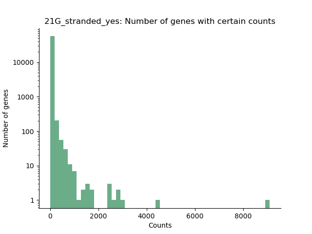

If our data was unstranded, the number of genes mapped to specific runs would be the same whether the strand direction was set to forward or reverse. This is not the case: visually the reverse strand plot has much more data mapped than the forward strand plot. Numerically 303,726 reads mapped on the forward strand and 6,636,009 reads mapped on the reverse strand. This 2084.87% increase, which is not insignificant in any sense of the word.

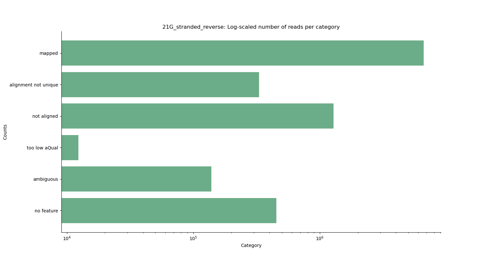
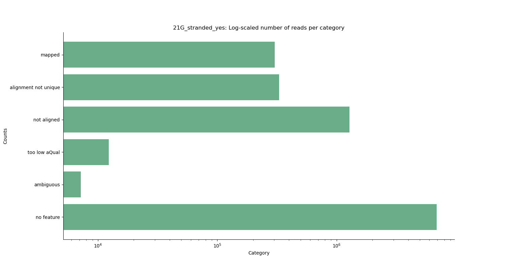

In the forward strand data, "no feature" dominates our read categories. In the reverse strand data, "mapped" dominates our read categories. This indicates that our data is stranded in the **reverse** direction.

#### 34_4H my script

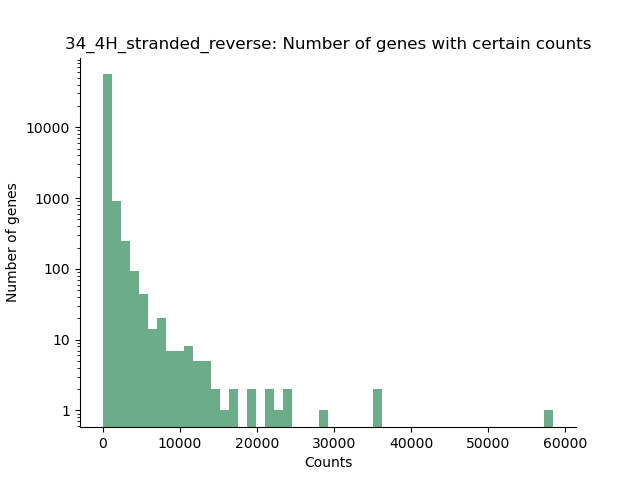
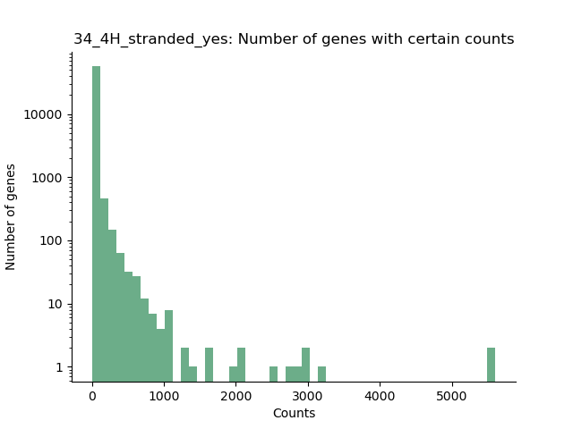

The same as was mentioned for `21_3G` holds true for `34_4H`. If our data was unstranded, the number of genes mapped to specific runs would be the same whether the strand direction was set to forward or reverse. This is not the case: visually the reverse strand plot has much more data mapped than the forward strand plot. Numerically, 


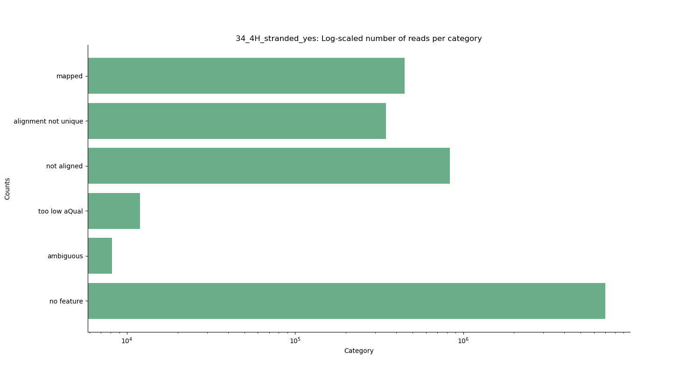
As mentioned in `21_3G`, in the forward strand data "no feature" dominates our read categories. In the reverse strand data, "mapped" dominates our read categories. This indicates that our data is stranded in the **reverse** direction.


With that QAA is...done! :bomb: