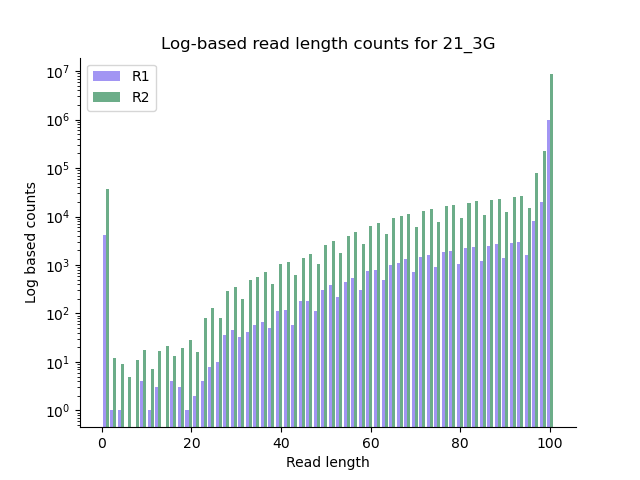
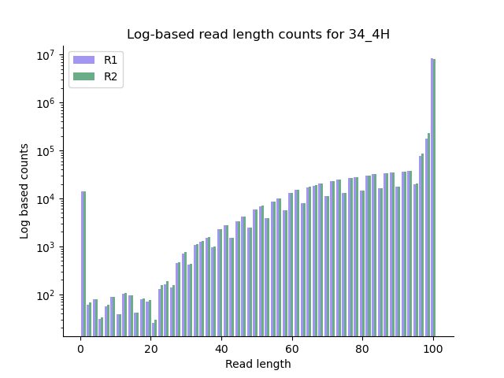

# QAA
CHANGE PS8 SO I JUST CHECK THE FIRST LINE! ! ! ! ! !


## Versions

Conda environment: QAA

**Python version:** 3.12

**fastqc version:** 0.12.1

**cutadapt version**: 0.9 

## Part 1

### Data Exploration:

Done with the following srun
```bash
srun -A bgmp -p bgmp --mem=30G --pty bash
```

My file assignments are:

- `34_4H_both_S24_L008`

- `21_3G_both_S15_L008`

The path to these files are :

```bash
/projects/bgmp/shared/2017_sequencing/demultiplexed/34_4H_both_S24_L008_R1_001.fastq.gz
/projects/bgmp/shared/2017_sequencing/demultiplexed/34_4H_both_S24_L008_R2_001.fastq.gz
/projects/bgmp/shared/2017_sequencing/demultiplexed/21_3G_both_S15_L008_R1_001.fastq.gz
/projects/bgmp/shared/2017_sequencing/demultiplexed/21_3G_both_S15_L008_R2_001.fastq.gz
```

### File size

```bash
ls -lh /projects/bgmp/shared/2017_sequencing/demultiplexed/ | grep 21_3G
-rw-r-----+ 1 coonrod is.racs.pirg.bgmp 480M Aug 23  2017 21_3G_both_S15_L008_R1_001.fastq.gz
-rw-r-----+ 1 coonrod is.racs.pirg.bgmp 535M Aug 23  2017 21_3G_both_S15_L008_R2_001.fastq.gz
ls -lh /projects/bgmp/shared/2017_sequencing/demultiplexed/ | grep 34_4H
-rw-r-----+ 1 coonrod is.racs.pirg.bgmp 469M Aug 23  2017 34_4H_both_S24_L008_R1_001.fastq.gz
-rw-r-----+ 1 coonrod is.racs.pirg.bgmp 525M Aug 23  2017 34_4H_both_S24_L008_R2_001.fastq.gz
```

The file sizes are closer group around their R1/R2 designation, not the index label.
This could indicate that these files have a similar number of reads returned.

### Number of records

Done with: `zcat file_path | awk 'END {print NR/4}'`

|File|record count|
|------|------------|
|34_4H_both_S24_L008_R1_001|9040597|
|34_4H_both_S24_L008_R2_001|9040597|
|21_3G_both_S15_L008_R1_001|9237299|
|21_3G_both_S15_L008_R2_001|9237299|

Within an index label (34_H, 21_3G) the number of records is the same. It appears that record 21_3G yielded slighly more records (2.1% more to be exact). This small difference is likely insignificant. So the difference in R1 vs R2 file size does not lie in the number of records, is it possibly due to record length?

### Record length

Done with `zcat file_path | awk 'NR%4==2{print length($0)}'| uniq -c`
With this I verified the record length was 101 for **every** file I was assigned. This makes sense because no trimming software has been used.

**y diff in file size :(**

### Command line fastqc

**Using `FastQC` via the command line on Talapas, produce plots of the per-base quality score distributions for R1 and R2 reads. Also, produce plots of the per-base N content, and comment on whether or not they are consistent with the quality score plots.**


Command used 

```bash
/usr/bin/time -v fastqc -o output_FASTQC_part1/ -t 8 /projects/bgmp/shared/2017_sequencing/demultiplexed/34_4H_both_S24_L008_R1_001.fastq.gz /projects/bgmp/shared/2017_sequencing/demultiplexed/34_4H_both_S24_L008_R2_001.fastq.gz /projects/bgmp/shared/2017_sequencing/demultiplexed/21_3G_both_S15_L008_R1_001.fastq.gz /projects/bgmp/shared/2017_sequencing/demultiplexed/21_3G_both_S15_L008_R2_001.fastq.gz

#with timing
Elapsed (wall clock) time (h:mm:ss or m:ss): 1:07.62
Maximum resident set size (kbytes): 2470100
Average resident set size (kbytes): 0
Major (requiring I/O) page faults: 39
Exit status: 0
```

Was a bit slower than expected but working at a cafe with iffy wifi so not surprising

I unzipped my results from this (located at `/home/jujo/bgmp/bioinfo/PS/QAA/output_FASTQC_part1/`) and summarized the relevant data below

#### 21_3G_both_S15_L008_R1_001


|Score|On|Original File|
|------|----|-------------|
|PASS |Per base sequence quality| 21_3G_both_S15_L008_R1_001.fastq.gz|
|PASS| Per base N content| 21_3G_both_S15_L008_R1_001.fastq.gz|


##### 21_3G_both_S15_L008_R1_001 N-content


##### 21_3G_both_S15_L008_R1_001 Per-base quality


#### 21_3G_both_S15_L008_R2_001

|Score|On|Original File|
|------|----|-------------|
|PASS |   Per base sequence quality|       21_3G_both_S15_L008_R2_001.fastq.gz|
|PASS|Per base N content|      21_3G_both_S15_L008_R2_001.fastq.gz|

##### 21_3G_both_S15_L008_R2_001 N-content


##### 21_3G_both_S15_L008_R2_001 Per-base quality


#### 34_4H_both_S24_L008_R1_001

|Score|On|Original File|
|------|----|-------------|
|PASS| Per base sequence quality|       34_4H_both_S24_L008_R1_001.fastq.gz|
|PASS| Per base N content |     34_4H_both_S24_L008_R1_001.fastq.gz|

##### 34_4H_both_S24_L008_R1_001 N-content


##### 34_4H_both_S24_L008_R1_001 Per-base quality


#### 34_4H_both_S24_L008_R2_001

|Score|On|Original File|
|------|----|-------------|
|PASS| Per base sequence quality|    34_4H_both_S24_L008_R2_001.fastq.gz|
|PASS| Per base N content |     34_4H_both_S24_L008_R2_001.fastq.gz|

##### 34_4H_both_S24_L008_R2_001 N-content


##### 34_4H_both_S24_L008_R2_001 Per-base quality


### My qscore script

I had to back to Demultiplex to explicity add argparse record length. This is 
because R2 in demultiplex was an index file (with record length 8) while our R2
is the equivalent to R4 and has a record length of 101. Once I fixed this I was
ready to run my old code.

I did this in two separate sbatch runs (qs_plotting_21 and qs_plotting_34) to speed this up.

- Both of these scripts are located in the `/home/jujo/bgmp/bioinfo/PS/QAA/output_my_qs_plotting_part1/` folder

#### 34_4H_both_S24_L008_R1_001

##### 34_4H_both_S24_L008_R1_001 Means

```bash
/usr/bin/time -v python /home/jujo/bgmp/bioinfo/PS/Demultiplex/Assignment-the-first/part1.py -f
/projects/bgmp/shared/2017_sequencing/demultiplexed/34_4H_both_S24_L008_R1_001.fastq.gz -R2 False> 34_4H_R1_means.txt

Elapsed (wall clock) time (h:mm:ss or m:ss): 5:11.11
Maximum resident set size (kbytes): 28448
Average resident set size (kbytes): 0
Exit status: 0
```

##### 34_4H_both_S24_L008_R1_001 Graphs

```bash
/usr/bin/time -v python /home/jujo/bgmp/bioinfo/PS/Demultiplex/Assignment-the-first/part1_graphs.py -f 34_4H_R1_means.txt

Elapsed (wall clock) time (h:mm:ss or m:ss): 0:01.90
Maximum resident set size (kbytes): 61556
Average resident set size (kbytes): 0
Exit status: 0
```


#### 34_4H_both_S24_L008_R2_001

##### 34_4H_both_S24_L008_R2_001 Means

```bash
/usr/bin/time -v python /home/jujo/bgmp/bioinfo/PS/Demultiplex/Assignment-the-first/part1.py -f
/projects/bgmp/shared/2017_sequencing/demultiplexed/34_4H_both_S24_L008_R2_001.fastq.gz -R2 True > 34_4H_R2_means.txt

Elapsed (wall clock) time (h:mm:ss or m:ss): 6:10.44
Maximum resident set size (kbytes): 28380
Average resident set size (kbytes): 0
Exit status: 0
```

##### Graphs

```bash
/usr/bin/time -v python /home/jujo/bgmp/bioinfo/PS/Demultiplex/Assignment-the-first/part1_graphs.py -f 34_4H_R2_means.txt

Elapsed (wall clock) time (h:mm:ss or m:ss): 0:00.79
Maximum resident set size (kbytes): 60776
Average resident set size (kbytes): 0
Exit status: 0
```


#### 21_3G_both_S15_L008_R1_001

##### 21_3G_both_S15_L008_R1_001 Means

```bash
/usr/bin/time -v python /home/jujo/bgmp/bioinfo/PS/Demultiplex/Assignment-the-first/part1.py -f
/projects/bgmp/shared/2017_sequencing/demultiplexed/21_3G_both_S15_L008_R1_001.fastq.gz > 21_3G_R1_means.txt

Elapsed (wall clock) time (h:mm:ss or m:ss): 6:25.08
Maximum resident set size (kbytes): 32720
Average resident set size (kbytes): 0
Exit status: 0
```

##### 21_3G_both_S15_L008_R1_001 Graphs 

```bash
/usr/bin/time -v python /home/jujo/bgmp/bioinfo/PS/Demultiplex/Assignment-the-first/part1_graphs.py -f 21_3G_R1_means.txt

Elapsed (wall clock) time (h:mm:ss or m:ss): 0:00.44
Maximum resident set size (kbytes): 62264
Average resident set size (kbytes): 0
Exit status: 0
```


### 21_3G_both_S15_L008_R2_001

#### 21_3G_both_S15_L008_R2_001 Means

```bash
/usr/bin/time -v python /home/jujo/bgmp/bioinfo/PS/Demultiplex/Assignment-the-first/part1.py -f
/projects/bgmp/shared/2017_sequencing/demultiplexed/21_3G_both_S15_L008_R2_001.fastq.gz -R2 True > 21_3G_R2_means.txt

Elapsed (wall clock) time (h:mm:ss or m:ss): 6:24.46
Maximum resident set size (kbytes): 28624
Average resident set size (kbytes): 0
Exit status: 0
```

#### 21_3G_both_S15_L008_R2_001 Graphs

```bash
/usr/bin/time -v python /home/jujo/bgmp/bioinfo/PS/Demultiplex/Assignment-the-first/part1_graphs.py -f 21_3G_R2_means.txt

Elapsed (wall clock) time (h:mm:ss or m:ss): 0:00.45
Maximum resident set size (kbytes): 60428
Average resident set size (kbytes): 0
Exit status: 0
```


**Describe how the `FastQC` quality score distribution plots compare to your own. If different, propose an explanation. Also, does the runtime differ? Mem/CPU usage? If so, why?**

### Comment on overall data quality

**Comment on the overall data quality of your two libraries. Go beyond per-base qscore distributions. Make and justify a recommendation on whether these data are of high enough quality to use for further analysis.**

## Part 2

After verifying my cutadapt and trimmomatric versions matched our specifications I proceeded

With the following srun

```bash
srun -A bgmp -p bgmp --mem=30G --pty bash
```

### Cutadapt

#### Determine adapters

**add if I figured out what the adapters were** (some sort of bordering counts thing?)
    - *Sanity check*: Use your Unix skills to search for the adapter sequences in your datasets and confirm the expected sequence orientations. Report the commands you used, the reasoning behind them, and how you confirmed the adapter sequences.

cut -c-22 file AGATCGGAAGAGCACACGTCTGAACTCCAGTCA
I know that our adapters are length 34, why ADD

Command I used:

Adapters will not be present in every sample on the 3' end, but because of Illuminas use of universal adapters, we can compare across disparate runs (file_path_34_4H_RN and file_path_21_3G_RN). In this case, the universal adapter should be the unifying sequence between the two. I verified this with the following bash command:

```bash
#cut -c 69- grabs our adapter size from the end of the sequence
zcat file_path_34_4H_RN file_path_21_3G_RN | cut -c 69- | awk 'NR%4==2{print $0}'| sort | uniq -c | sort -nr | head -n 1
```

##### R1 adapter

```bash
14311 AGATCGGAAGAGCACACGTCTGAACTCCAGTCA
```

I verified with the hint, that AGATCGGAAGAGCACACGTCTGAACTCCAGTCA,  was indeed our R1 adapter

##### R2 adapter

```bash
  14364 AGATCGGAAGAGCGTCGTGTAGGGAAAGAGTGT
```

I verified with the hint, that AGATCGGAAGAGCGTCGTGTAGGGAAAGAGTGT,  was indeed our R2 adapter

#### Cutadapt Run 

##### 21_3G percent trimmed

For my actual run I used the following command

```bash
#for 21_3G
/usr/bin/time -v cutadapt -a AGATCGGAAGAGCACACGTCTGAACTCCAGTCA -A AGAT
CGGAAGAGCGTCGTGTAGGGAAAGAGTGT -o output_cutadapt_part2/21_3G_both_S15_L008_R1_001_trimmed.fastq
 -p output_cutadapt_part2/21_3G_both_S15_L008_R2_001_trimmed.fastq /projects/bgmp/shared/2017_s
equencing/demultiplexed/21_3G_both_S15_L008_R1_001.fastq.gz /projects/bgmp/shared/2017_sequenci
ng/demultiplexed/21_3G_both_S15_L008_R2_001.fastq.gz

Percent of CPU this job got: 98%
Elapsed (wall clock) time (h:mm:ss or m:ss): 0:41.58
Maximum resident set size (kbytes): 37492
Average resident set size (kbytes): 0
Exit status: 0
```

This run produced the following trimmed proportions

- 21_3G_R1 proportion trimmed 6.6%
- 21_3G_R2 proportion trimmed 7.4%


##### 34_4H percent trimmed 

I used the following command

```bash
/usr/bin/time -v cutadapt -a AGATCGGAAGAGCACACGTCTGAACTCCAGTCA -A AGAT
CGGAAGAGCGTCGTGTAGGGAAAGAGTGT -o output_cutadapt_part2/34_4H_both_S24_L008_R1_001_trimmed.fastq
 -p output_cutadapt_part2/34_4H_both_S24_L008_R2_001_trimmed.fastq /projects/bgmp/shared/2017_s
equencing/demultiplexed/34_4H_both_S24_L008_R1_001.fastq.gz /projects/bgmp/shared/2017_sequenci
ng/demultiplexed/34_4H_both_S24_L008_R2_001.fastq.gz

Percent of CPU this job got: 98%
Elapsed (wall clock) time (h:mm:ss or m:ss): 0:43.88
Maximum resident set size (kbytes): 37488
Average resident set size (kbytes): 0
Exit status: 0
 ```

This run produced the following trimmed proportions

- 34_4H_R1 proportion trimmed 9.1%
- 34_4H_R2 proportion trimmed 9.8%


#### Cutadapt interpretation

- Our 34_4H files were trimmed **more** than our 21_3G files
- Our R2 files were trimmed more than our R1 files.

# Wrong ! graphs not until trimmomatic


**Note:** For this section, the code and figures below are all stored in `/home/jujo/bgmp/bioinfo/PS/QAA/output_my_qs_plotting_part1`

To measure the proportion of trimmed reads within our cutadapt results I did the following command on all my cutadapt results:

```bash
awk 'NR%4==2{print length($0)}' file_path >file_path_length_distributions.txt
```

This gave me the lengths of all sequences within my cutadapt files :exploding_head:

I then created the python script `cut_adapt_graph.py` to calculate the trimmed proportions and desired graph. 

Trimmed proportions were calculated with:

```bash
#get all lengths as integers
len_list=fh.read().strip().split("\n")
len_list=[int(x) for x in len_list]
#we know our untrimmed length is 101 from our EDA
l_prop_trimmed=((len(len_list)-len_list.count(101))/len(len_list))*100
```

My graph was calculated with:

- A ylog scale for readability

- The two histograms overlaid with `plt.hist([R1,R2])`

What proportion of reads (both R1 and R2) were trimmed?



- 21_3G_R1 proportion trimmed 6.6%
- 21_3G_R2 proportion trimmed 7.4%



- 34_4H_R1 proportion trimmed 9.1%

- 34_4H_R2 proportion trimmed 9.8%


### Trimmomatic
```bash
I ran this on the same srun as cutadapt
trimmomatic PE \ 
/projects/bgmp/shared/2017_sequencing/demultiplexed/34_4H_both_S24_L008_R1_001.fastq.gz \
/projects/bgmp/shared/2017_sequencing/demultiplexed/34_4H_both_S24_L008_R2_001.fastq.gz \
34_4H_R1_clean.paired.fastq.gz 34_4H_R1_clean.unpaired.fastq.gz \
34_4H_R2_clean.paired.fastq.gz 34_4H_R2_clean.unpaired.fastq.gz \
ILLUMINACLIP:/home/jujo/bgmp/bioinfo/PS/QAA/output_trimmomatic_part2/adapters.fa \
LEADING:3 TRAILING:3 SLIDINGWINDOW:5:15 MINLEN:35
```

Comment on whether you expect R1s and R2s to be adapter-trimmed at different rates and why.
